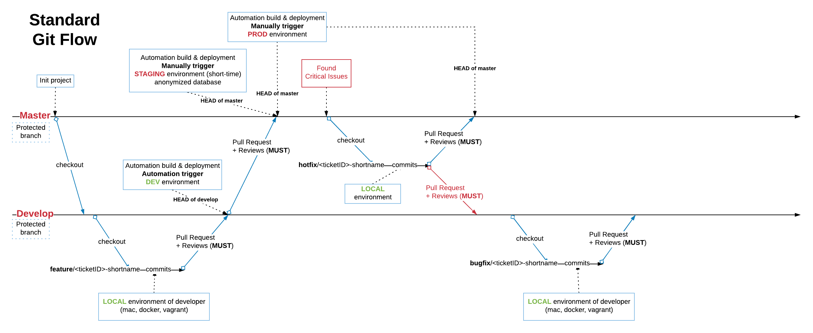

# Standard Git flow

**Goal**: providing & implementing standards in working with Git and improving process of development team

**Scope**: focus on building **Git Flow** for small & MVP projects at FRM first, then extending/customing for big team later

Basically, our **Git Flow** will be a simple version of **Gitflow** [which is a success of Git Branching Model](https://nvie.com/posts/a-successful-git-branching-model) but customized for easy follow-ups and require less effort of developer from the first time.

### 1. MVP Git flow for small projects at FRM



Source image: https://www.lucidchart.com


#### A. Main Branches (protected)
At the core, the development model is greatly inspired by existing models out there. The central repo holds two main branches with an **infinite lifetime**:
```
- master
- develop
```

The `master` branch at origin should be familiar to every Git user. Parallel to the master branch, another branch exists called `develop`. This `develop` branch will be checked out from `master` when setting up project in the first time.

Both of `master` and `develop` branches will **be protected**. It means:
* Disables force-pushes to the branch and prevents from being deleted.
* Require pull request reviews before merging. 
* All commits must be made to a non-protected branch and submitted via a pull request with 2 (at least) of approving reviews and no changes requested before it can be merged into a branch that matches this rule.
* Disable `cherry-picking` on `master` and `develop` because it creates a duplicate commit with the same changes and you lose the ability to track the history of the original commit. But we do not force disable `cherry-picking` on other branches (use it with caution!)


#### B. Environment & FLows

1. **LOCAL** environment: 
    - especially on developer machine which is using docker, vagrant for developing new feature or plan to fix bugs
    - developer will checkout new branches from HEAD of `develop` when start doing something:
      - `feature/<ticketID>-shortname` for new feature
      - `bugfix/<ticketID>-shortname` for fixing bugs
    - After done & tested on **LOCAL** environment, should do a **Pull Request** back to `develop`, ask for reviews & approval 

2. **DEV** environment: 
    - It's on cloud provider (currently it's on AWS), simple & small infra arch, only for showing & testing features before golive
    - `origin/develop` to be the main branch where the source code of `HEAD` always reflects a state with the latest delivered development changes for the next release.
    - Be merged from feature/hotfix/bugfix branches via PR
    - This is where any **automatic** nightly builds are built from
    - After done & tested on **DEV** environment, should do a **Pull Request** to `master`, ask for reviews & approval, ready for next release

3. **PROD** environment: 
    - It's production environment, serving for end-user
    - On cloud provider (currently it's on AWS), HA & scalable
    - `origin/master` to be the **main branch** where the source code of `HEAD` always reflects a **production-ready** state
    - Be merged only from `develop`/`hotfix` branches via PR
    - Therefore, each time when changes are merged back into master, **this is a new production release** by definition. We tend to be very strict at this, so that theoretically, whenever a release pull out, it should receive the **approval** from stack holders, such as PO, PM or TL. One of them will make a **trigger manually** to build via Jenkins CI.

4. **STAGING** environment (Optional)
    - Optional environment, only provision when needed
    - Will be the same infra arch with **PROD** environment
    - Use the same HEAD of `master` as **PROD**
    - Short-time & Terminate when done

Important note: At some points in **PROD**, we found critical issues, then the flow for **hotfix** will be:
* Checked out new branch `hotfix/<ticketID>-shortname` directly from `master` branch
* Commits & test carefully on **LOCAL**
* Make 2 PRs into `develop` and `master`
* Review & Approval on `develop` first --> verify on **DEV**
* Review & Approval on `master` --> deploy to **PROD** --> verify --> DONE


### 2. Future Plan for big/large-scale projects at FRM

